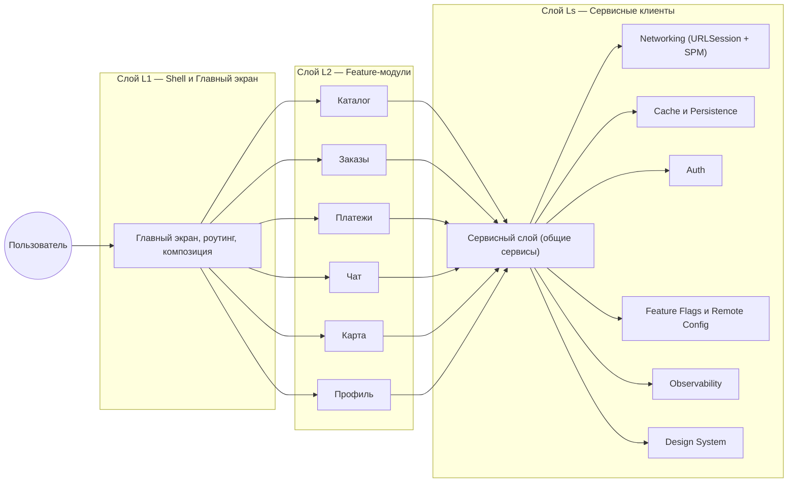

# iOS System Design — Super App (слои L1/L2/Ls + SDUI)

## Что такое суперапп
Суперапп — модульное мобильное приложение‑платформа, объединяющее несколько доменов (маркетплейс, платежи, чат, карты и т.д.) с общими сервисами (навигация, дизайн‑система, наблюдаемость, авторизация, аналитика, конфигация). Цель — быстрый запуск и эволюция «мини‑приложений» в одном контейнере без деградации DX/UX.

## Принципы
- Модульность: независимые feature‑модули с чёткими контрактами
- Общие сервисы (Ls): переиспользуемые клиентские сервисы
- Изоляция: минимум кросс‑зависимостей (через протоколы/DI, не через импорт типов)
- Runtime расширяемость: SDUI/Remote Config для конфигурации экранов и флоу
- Наблюдаемость/качество: единые SLI/SLO, мониторинг, фича‑флаги

---

## Слои (горизонтально)

### L1 — Shell/Главный экран
- Роутинг: табы/главный дашборд, оркестрация входов (deeplink/push)
- Entry points: App/Scene lifecycle, session manager
- Композиция модулей L2 (регистрация, контейнеры, surface area)

### L2 — Feature‑модули (аппы/экраны)
- Каталог/Маркет, Заказы, Платежи, Чат, Карта, Профиль и т.п.
- Каждый модуль: публичный интерфейс (протоколы), навигация, DI
- Независимые релизы (SPM targets), контрактные тесты

### Ls — Сервисный слой (import в L2)
- Сетевой слой (APIClient), кеш/персистентность, фичефлаги/конфиг
- Аутентификация, локализация, дизайн‑система/компоненты
- Обсервабилити (логирование, метрики, трассировка)

---

## Mermaid: слои и связи

---

## SDUI (Server‑Driven UI)

### Идея
Сервер описывает конфигурацию экранов/виджетов (JSON/Protobuf): layout, компоненты, действия. Клиент имеет реестр (registry) компонентов и умеет безопасно «строить» экраны из схемы.

### Контракт
- Endpoint: GET /sdui/screen?name=home&version=…
- Schema: version, widgets[], actions[], data bindings
- Policy: TTL/кеш, prefetch, offline fallback, совместимость версий

### Клиент
- SDUIRenderer: принимает модель → строит дерево View (SwiftUI предпочтительно)
- ComponentRegistry: mapping type → ViewBuilder
- ActionHandler: навигация/интеракции/телеметрия

### Ограничения iOS
- App Store review: недопустимые изменения функциональности вне правил
- Безопасность: только декларативная конфигурация; закрыть eval/JS
- Доступность/локализация: тексты/форматы из схемы

---

## Навигация и контракты
- DeepLinkRouter: app:// и Universal Links; mapping → L2 модули
- PushRouter: категории → экраны/flows;恢复 state
- Модули публикуют протоколы: CatalogRouting, PaymentsRouting …

---

## Observability и качество
- SLI/SLO per модуль: p95 навигации, error rate, TTI, crash‑free
- Central telemetry: screen/view events, network timings, retries
- Feature flags: раскатка L2 фич; kill‑switches

---

## Trade‑offs
- SDUI ускоряет delivery, но усложняет контракт и тестирование
- Модули SPM уменьшают связность, но увеличивают поверхностные контракты
- Общие сервисы ускоряют, но могут стать bottleneck → versioning и SLA

---

## Шаблон заполнения (Super App)
- L1: табы, входные точки, стратегия deeplink/push → …
- L2: список модулей, публичные протоколы, зависимые сервисы → …
- Ls: перечислить сервисы и версии контрактов → …
- SDUI: схема компонентов, политики, registry → …
- Observability: метрики, алерты, dashboards → …
- Риски: совместимость, hot‑update границы, тестирование → …

