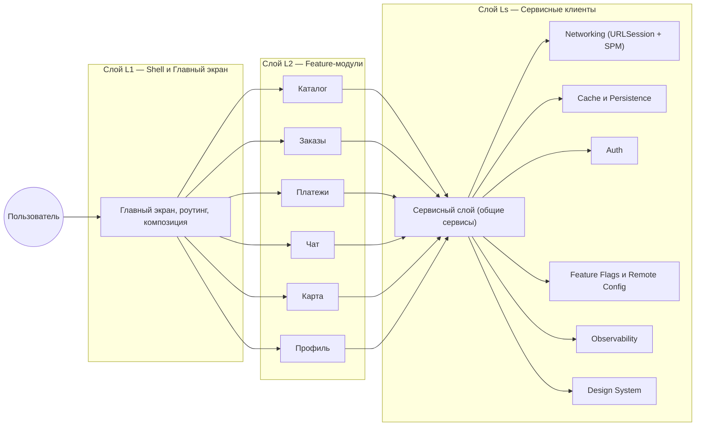
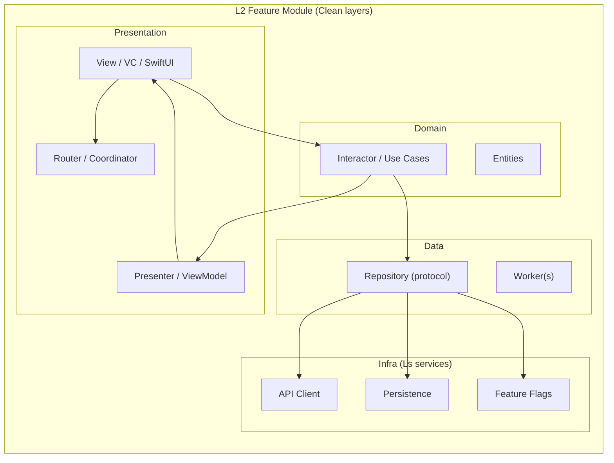
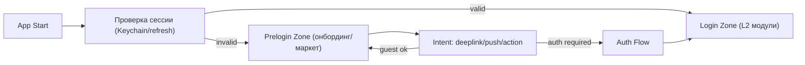
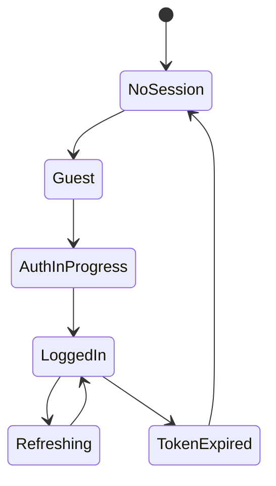

# iOS System Design — Super App (слои L1/L2/Ls + SDUI)

## Что такое суперапп
Суперапп — модульное мобильное приложение‑платформа, объединяющее несколько доменов (маркетплейс, платежи, чат, карты и т.д.) с общими сервисами (навигация, дизайн‑система, наблюдаемость, авторизация, аналитика, конфигация). Цель — быстрый запуск и эволюция «мини‑приложений» в одном контейнере без деградации DX/UX.

## Принципы
- Модульность: независимые feature‑модули с чёткими контрактами
- Общие сервисы (Ls): переиспользуемые клиентские сервисы
- Изоляция: минимум кросс‑зависимостей (через протоколы/DI, не через импорт типов)
- Runtime расширяемость: SDUI/Remote Config для конфигурации экранов и флоу
- Наблюдаемость/качество: единые SLI/SLO, мониторинг, фича‑флаги

---

## Слои (горизонтально)

### L1 — Shell/Главный экран
- Роутинг: табы/главный дашборд, оркестрация входов (deeplink/push)
- Entry points: App/Scene lifecycle, session manager
- Композиция модулей L2 (регистрация, контейнеры, surface area)

### L2 — Feature‑модули (аппы/экраны)
- Каталог/Маркет, Заказы, Платежи, Чат, Карта, Профиль и т.п.
- Каждый модуль: публичный интерфейс (протоколы), навигация, DI
- Независимые релизы (SPM targets), контрактные тесты

### Ls — Сервисный слой (import в L2)
- Сетевой слой (APIClient), кеш/персистентность, фичефлаги/конфиг
- Аутентификация, локализация, дизайн‑система/компоненты
- Обсервабилити (логирование, метрики, трассировка)

---

## Mermaid: слои и связи

### Внутри L2: Clean слои (Presentation → Domain → Data → Infra/Ls)

Показываем: зависимости направлены наружу — Presentation → Domain → Data → Infra (Ls). Сервисы Infra предоставляются общим слоем Ls; модули L2 зависят от них через протоколы/DI.

---

## SDUI (Server‑Driven UI)

### Идея
Сервер описывает конфигурацию экранов/виджетов (JSON/Protobuf): layout, компоненты, действия. Клиент имеет реестр (registry) компонентов и умеет безопасно «строить» экраны из схемы.

### Контракт
- Endpoint: GET /sdui/screen?name=home&version=…
- Schema: version, widgets[], actions[], data bindings
- Policy: TTL/кеш, prefetch, offline fallback, совместимость версий

### Клиент
- SDUIRenderer: принимает модель → строит дерево View (SwiftUI предпочтительно)
- ComponentRegistry: mapping type → ViewBuilder
- ActionHandler: навигация/интеракции/телеметрия

### Ограничения iOS
- App Store review: недопустимые изменения функциональности вне правил
- Безопасность: только декларативная конфигурация; закрыть eval/JS
- Доступность/локализация: тексты/форматы из схемы

---

## Навигация и контракты
- DeepLinkRouter: app:// и Universal Links; mapping → L2 модули
- PushRouter: категории → экраны/flows;恢复 state
- Модули публикуют протоколы: CatalogRouting, PaymentsRouting …

---

## Observability и качество
- SLI/SLO per модуль: p95 навигации, error rate, TTI, crash‑free
- Central telemetry: screen/view events, network timings, retries
- Feature flags: раскатка L2 фич; kill‑switches

---

## Trade‑offs
- SDUI ускоряет delivery, но усложняет контракт и тестирование
- Модули SPM уменьшают связность, но увеличивают поверхностные контракты
- Общие сервисы ускоряют, но могут стать bottleneck → versioning и SLA

---

## Шаблон заполнения (Super App)
- L1: табы, входные точки, стратегия deeplink/push → …
- L2: список модулей, публичные протоколы, зависимые сервисы → …
- Ls: перечислить сервисы и версии контрактов → …
- SDUI: схема компонентов, политики, registry → …
- Observability: метрики, алерты, dashboards → …
- Риски: совместимость, hot‑update границы, тестирование → …

---

## Prelogin/Login зоны

### Зачем делить
- Prelogin: максимум доступной функциональности без сессии (брoузинг, маркетинг, онбординг, SDUI‑баннеры), минимальный вес и зависимости
- Login: персональные данные, заказы, чат, платежи; защищённые эндпоинты

### Рекомендуемая архитектура
- Отдельные координаторы/роутеры для Prelogin и Login
- AuthService (Ls): хранение токенов (Keychain), refresh, device binding
- Feature flags/Remote config: управляют онбордингом и entry‑плитками

### Диаграмма: Bootstrap и intent

### Диаграмма: Состояния сессии

### SDUI в Prelogin
- SDUI‑экраны (маркетинг/витрины), ограниченные действия, безопасная схема
- Политика: TTL, кеш, оффлайн fallback

### Безопасность
- Токены в Keychain; refresh с защитой от гонок; device binding
- Защита deeplink/push действий в prelogin (только разрешённые)

### Clean Auth (внутри L2)
- Use cases: `Login`, `Logout`, `RefreshToken`
- Repo: `AuthRepository` (протокол), `SecureTokenStore`
- Infra: `AuthAPI`, `KeychainStore`

---

## System Design — Проблемы и решения

### Карточка: Холодный старт (>1.5s)

#### Проблема
Длительный холодный старт приложения (TTI > 1.5–2.0s), чувствительный к инициализации модулей L2/Ls и SDUI.

#### Контекст и ограничения
- iOS 15+, суперапп с десятками модулей; SDUI может подтягивать конфиг при старте.
- SLA: первый интерактивный жест за ≤1.5s на p95 для топ‑девайсов, ≤2.2s на p95 для средних.

#### Требования
- Минимизировать работу на main‑thread до первого интерактива.
- Отложить «тяжёлые» инициализации до момента первого использования.
- Гарантировать стабильный рендер первого экрана (skeleton/placeholder).

#### Решение
- Bootstrap‑план: фазировать старт (0–300 ms: UI каркас, 300–800 ms: критические сервисы, >800 ms: ленивые сервисы).
- Lazy/On‑demand init L2/Ls: DI‑контейнер предоставляет фабрики вместо singleton‑инициализации «на старте».
- Предзагрузка кешей в фоне (images/fonts/config) после первого кадра; SDUI‑конфиг c TTL и оффлайн‑fallback.
- Исключить тяжёлые статические инициализации/глобальные конструкторы; избегать синхронного IO.
- Измерения: OSLog signposts вокруг инициализаций; watchdog для «подозрительных» участков.

#### Сбои и деградации
- Таймаут загрузки SDUI → показываем локальный дефолтный layout.
- Неуспех дизайн‑системы/иконпаков → fallback на базовые системные шрифты/ресурсы.

#### Тестирование
- Перф‑тест старта на разных девайсах; замеры TTI/First Frame; эмуляция холодного кэша.
- Контрактные тесты DI: отсутствие неявных «ранних» инициализаций.

#### Наблюдаемость
- Метрики: p50/p95 TTI, доля стартов >2s, количество lazy‑инициализаций до TTI.
- Трейсы: фазы старта; ошибки SDUI/конфигов.

#### Компромиссы и альтернативы
- Предзагрузка даёт плавность, но увеличивает фоновые расходы/энергию.
- Сквозной SDUI старта ускоряет delivery, но повышает зависимость от сети.

#### Риски и фоллоу‑апы
- Регресс производительности при добавлении новых модулей → гейты на PR (TTI budget).
- Актуализировать список «критических» сервисов раз в квартал.

---

### Карточка: Чекаут/Платежи (3DS, сети, надёжность)

#### Проблема
Нестабильность чекаута: повторы, зависания при 3DS, потеря состояния, двойные списания.

#### Контекст и ограничения
- Платёжный шлюз (Stripe/Adyen/CloudPayments), возможна 3DS/Redirect, Apple Pay.
- SLA: успех чекаута p95 ≥ 99.5%, время завершения ≤ 20s p95.

#### Требования
- Идемпотентность на всех уровнях; восстановление сессии после перезапуска.
- Прозрачные состояния UI: `processing`, `action_required (3DS)`, `completed`, `failed`.

#### Решение
- CheckoutSession: единый объект состояния (id, статус, clientSecret), сохранение в Persistence.
- Идемпотентные ключи на все POST/confirm; дедупликация in‑flight запросов.
- 3DS/Redirect контроллер с таймаутом и безопасным возвратом; наблюдение `UIApplication` сцены.
- Ретраи с экспоненциальным бэкофом по сетевым ошибкам; чтение `Retry‑After`.
- Apple Pay как альтернативный маршрут; graceful cancel.
- Журнал событий (audit) без PII; маскирование чувствительных данных.

#### Сбои и деградации
- Если confirm неизвестен → запрашиваем статус `CheckoutSession` (server‑authoritative) и отражаем в UI.
- Недоступность шлюза → предлагаем альтернативный метод/отложенный платеж (hold order).

#### Тестирование
- Интеграционные флоу: happy‑path, 3DS timeout/cancel, сеть flakey, повтор запуска приложения.
- Контрактные тесты идемпотентности; тесты сохранения и восстановления `CheckoutSession`.

#### Наблюдаемость
- Метрики: success rate, p95 завершения, доля ретраев, share 3DS, drop‑offs.
- Логи: корреляция по `checkoutSessionId`, унифицированные коды ошибок.

#### Компромиссы и альтернативы
- Агрессивные ретраи увеличивают задержку; лимит попыток + backoff‑политики.
- Полное оффлайн‑чекаут невозможно; допускается только резервирование заказа.

#### Риски и фоллоу‑апы
- Несогласованность статусов заказа/платежа → периодическая сверка и reconciliation‑эндпоинт.
- Регулярные «чёрные ящики» 3DS на некоторых банках → список известных проблем и обходы.

---

### Карточка: Offline‑first заказы/формы

#### Проблема
Потеря действий пользователя при отсутствии сети; дубль запросов после восстановления.

#### Контекст и ограничения
- Оформление заказов/форм с медиа; перемежающаяся сеть; фоновые ограничения iOS.

#### Требования
- Гарантированная доставка действий; отсутствие дублей на сервере.
- Прозрачный UX: локальные статусы, синхронизация в фоне.

#### Решение
- Outbox‑журнал: локальная очередь действий (insert/update/delete), атомарная запись.
- Идемпотентные POST с клиентским ключом; серверная дедупликация.
- Конфликт‑резолвинг: версии/ревизии, `If‑Match`/ETag; merge на сервере.
- Фоновые таски BGTaskScheduler для синка; backoff и группировка партий.
- UI‑индикаторы: «ожидает отправки», «синхронизировано», «конфликт — требуется действие».

#### Сбои и деградации
- Медиа не загрузилось → резюмируемые загрузки, уменьшение качества/размера.
- Критические ошибки синка → ручной ретрай, экспорт журнала для саппорта.

#### Тестирование
- Симуляция пропажи/возврата сети; перезапуск приложения; массовые изменения.
- Нагрузочные тесты очереди (1000+ действий).

#### Наблюдаемость
- Метрики: время до доставки p95, размер outbox, доля конфликтов, доля фатальных ошибок.
- Логи: трассировка по actionId, репорты синка по партиям.

#### Компромиссы и альтернативы
- Полный CRDT сложен; для большинства форм хватает server‑authoritative merge.
- Хранение outbox увеличивает потребление диска — нужна ротация и TTL.

#### Риски и фоллоу‑апы
- Ошибки схем при миграциях БД → миграции по версиям, откаты, бэкап.
- Прогресс‑баров для медиа достаточно? Проверить UX исследованиями.

---

### Карточка: Надёжные пуши и обработка уведомлений

#### Проблема
Пользователь не получает или теряет актуальность уведомлений; дубли/гонки при открытии.

#### Контекст и ограничения
- APNs, возможны silent‑пуши; фоновые окна iOS ограничены; разные типы уведомлений.

#### Требования
- Доставка с актуализацией данных; отсутствие дублей; корректное восстановление состояния.

#### Решение
- Silent push + фоновая синхронизация ключевых сущностей; TTL и `collapse_id`.
- Категории уведомлений → маршрутизация к L2‑роутерам; безопасные deep‑links.
- Idempotency по `notificationId`; локальная дедупликация; хранение lastSeen ids.
- Fallback: BGAppRefresh, ручная синхронизация при открытии.
- Тонкая настройка content‑available и приоритетов; экономия батареи.

#### Сбои и деградации
- Недоступность бэкенда при silent‑пуше → планируем отложенную синхронизацию.
- Повтор старых пушей → проверка версии/времени, игнорирование просроченных.

#### Тестирование
- Интеграционные сценарии: доставка, открытие из пуша, deeplink, дедупликация.
- Тесты при выключенных разрешениях; симуляция задержек APNs.

#### Наблюдаемость
- Метрики: delivery/open rate, доля silent‑успехов, средняя задержка до актуализации данных.
- Логи: `notificationId` и тип; ошибки маршрутизации.

#### Компромиссы и альтернативы
- Агрессивные silent‑пуши повышают расход батареи; балансировать частотой.
- Полагаться только на пуши нельзя — нужен pull‑fallback.

#### Риски и фоллоу‑апы
- Смена токена APNs без синка → периодическая валидация/обновление токена.
- Регламенты категорий и deeplink‑безопасности.

---

### Карточка: Синхронизация профиля между устройствами

#### Проблема
Конфликты и потеря изменений при редактировании профиля с разных устройств.

#### Контекст и ограничения
- Профиль содержит персональные данные; требования к аудитам/истории изменений.

#### Требования
- Консистентность данных; понятное поведение при конфликте; аудит изменений.

#### Решение
- Версионирование сущности: `version`/`revision`, `updatedAt`, `updatedBy`.
- ETag/If‑Match в API; отклонение устаревших изменений с кодом `409 Conflict`.
- Server‑authoritative merge: last‑write‑wins или field‑level merge по белому списку.
- UI для конфликтов: показать отличающиеся поля, предложить выбор/слияние.
- Локальный кэш с invalidation по событиям (push/pull) и по истечению TTL.

#### Сбои и деградации
- Недоступен merge на сервере → блокировка редактирования, сохранение в draft.
- В офлайне — локальный draft + последующая попытка синка с проверкой версий.

#### Тестирование
- Параллельные изменения с разных устройств; сценарии 409; восстановление драфта после краша.

#### Наблюдаемость
- Метрики: частота конфликтов, доля авто‑merge, доля ручных разрешений, время до консистентности.
- Логи/аудит: кто/что/когда поменял; связка по userId и revision.

#### Компромиссы и альтернативы
- Поле‑уровневый merge сложнее, но улучшает UX; можно начать с LWW.

#### Риски и фоллоу‑апы
- Юридические требования к хранению истории изменений → ретеншн/маскирование.
- Валидация схемы профиля при изменениях контрактов API.
