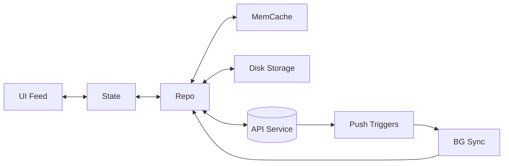
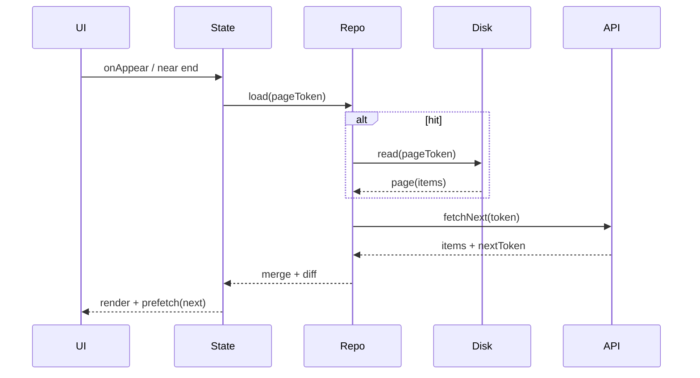
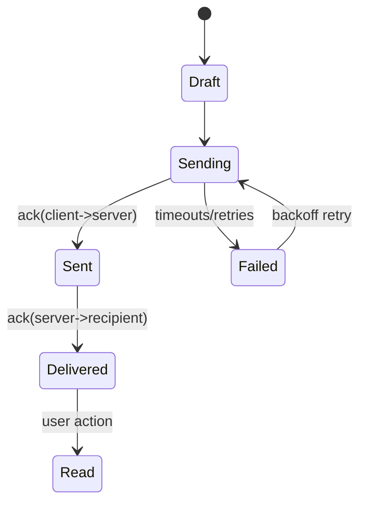
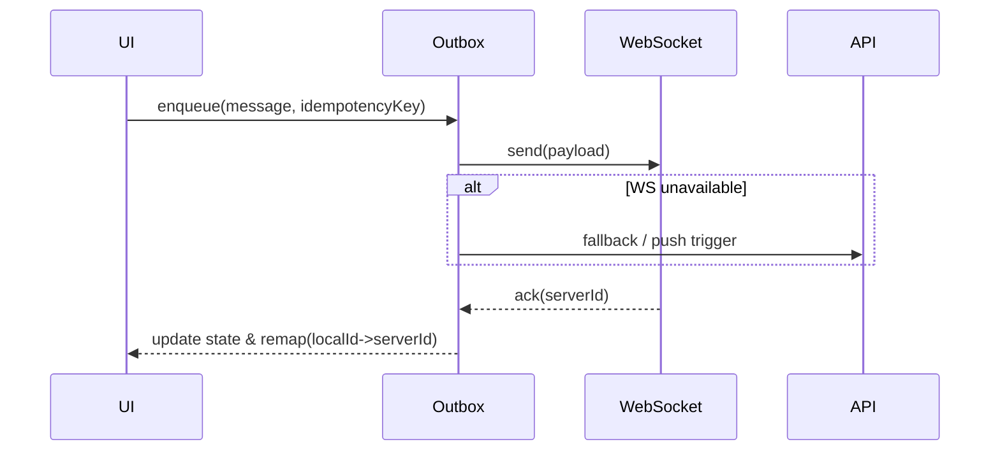
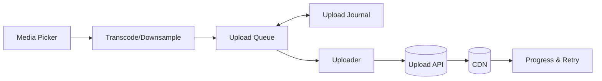
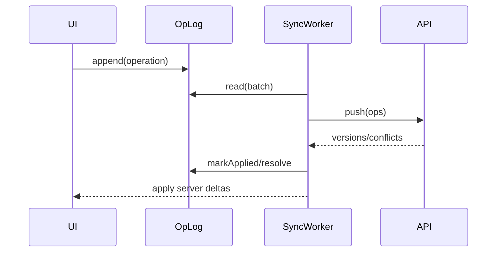
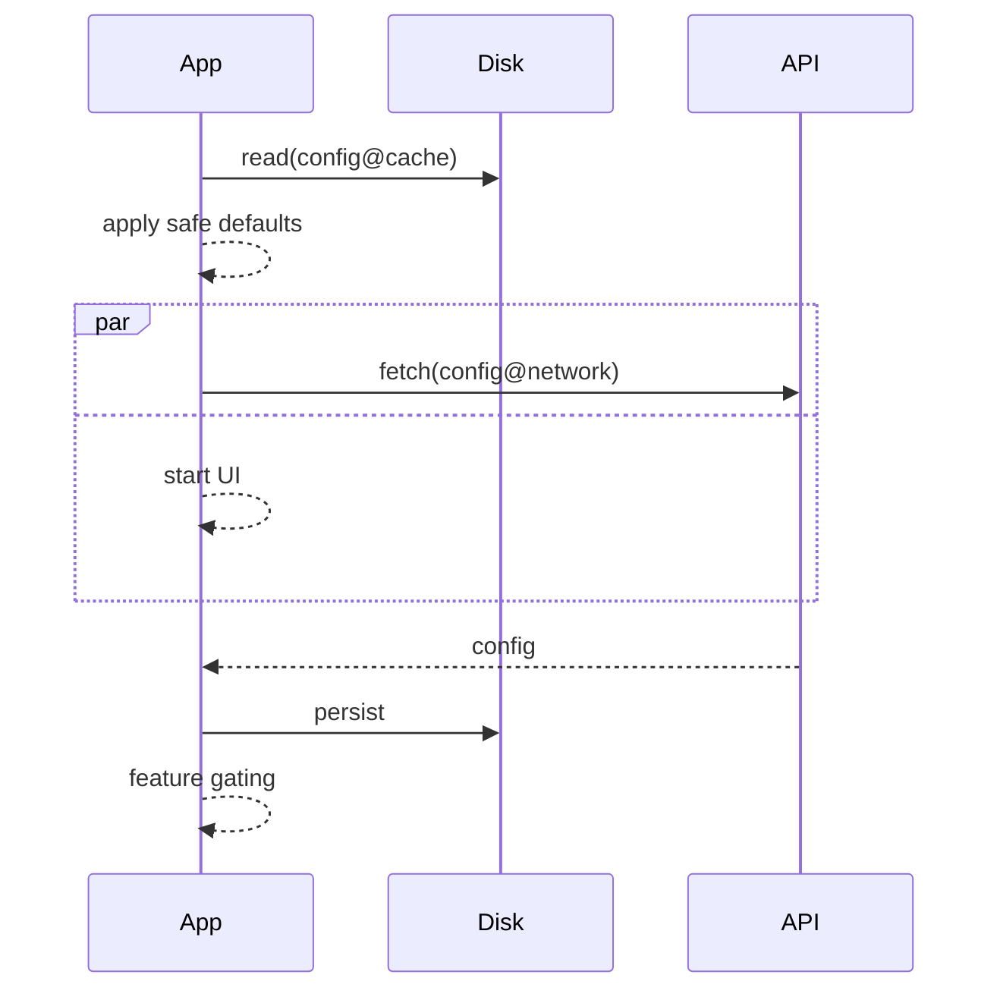

# Mobile System Design (iOS) — Crash Prep за 1 день

> Цель: за вечер выучить «скрипт ответа», решить 5 типовых задач, натренировать трейд‑оффы и iOS‑специфику.

---

## 0) План на 90 минут

**Помодоро 1 (30 мин):** прочти «Скрипт ответа», чек‑листы, типовые ошибки.  
**Помодоро 2 (30 мин):** разбор 1–2 задач (Лента + Чат) по шаблону.  
**Помодоро 3 (30 мин):** разбор 3 задач (Аплоадер, Offline‑Sync, Feature Flags) по шаблону.  
**Бонус (15 мин):** мини‑викторина и «фразы‑якоря».

---

## 1) Скрипт ответа (держи в голове)

1. **Цели & метрики**: время холодного старта, p95 latency, плавность скролла, батарея, crash‑free p99.
    
2. **User‑flows**: онлайн/оффлайн, регионы, рост, Privacy/PII.
    
3. **Клиентская архитектура**: UI/State → Domain → Data. Кэш‑пирамида (in‑memory → on‑disk → network), политика инвалидации, пагинация, prefetch.
    
4. **Сеть**: идемпотентность, ретраи/таймауты/кэш‑контроль, backoff, сжатие, мониторинг сети, деградации UI.
    
5. **Фон**: что уезжает в background (fetch/sync/upload), когда будить приложениe, как не сжечь батарею.
    
6. **Realtime/Push**: когда WebSocket, когда хватает пушей; гарантии доставки; offline очереди.
    
7. **Данные**: схемы, миграции, консистентность, конфликты.
    
8. **Наблюдаемость**: логи/метрики/трейсы, feature flags, безопасные роллауты.
    
9. **Эволюция & трейд‑оффы**: MVP → модульность, защита от регрессий.
    

> Формула вступления (20–30 сек): «Определю цели, проговорю клиентскую архитектуру и кэши, сеть и фон, затем realtime/push, оффлайн и наблюдаемость. По ходу — риски и трейд‑оффы».

---

## 2) Обозначения (легенда диаграмм)

- **[UI]** — презентационный слой; **[State]** — единый источник правды для экрана;
    
- **[Repo]** — фасад кэш‑пирaмиды; **[MemCache]** — NSCache/in‑memory; **[Disk]** — файлы/SQLite/CoreData;
    
- **[API]** — сетевой слой; **[BG]** — фоновые задачи; **[Push]** — триггеры.
    

---

## 3) Типовые задачи (что спрашивают)

- **Лента (Feed)**: пагинация, prefetch, кэш слоёв, offline просмотр, дельта‑обновления, конфликты.
    
- **Чат**: local‑first очередь отправки, идемпотентность, подтверждения (delivered/read), reconnection, бэкап/восстановление.
    
- **Медиа‑аплоадер**: chunking, возобновление, фоновые аплоады, ограничение по батарее/сети, прогресс.
    
- **Offline‑sync**: источник истины, журналы операций, правила мерджа (LWW/CRDT‑подходы), silent push как триггер.
    
- **Feature flags/Remote config**: быстрые роллауты/откаты, кеширование конфигов, вариации, телеметрия exposure.
    

---

## 4) Практикум №1 — Лента (как Instagram)

**Требования**: холодный старт < ~1–1.5с до skeleton UI; плавный скролл; offline 50 карточек; обновления по дельтам; экономия батареи.  
**Ключевые решения**:

- Пирамида кэшей: `[MemCache]` (последние N карточек) → `[Disk]` (SQLite/файлы для списков) → `[API]`.
    
- Пагинация: cursor/continuation‑token (устойчивее оффсетов).
    
- Prefetch: предзагружаем следующий блок, картинки — отдельно (downsample + диск‑кэш).
    
- Offline: отображаем кэш, ставим дельта‑синк в BG.
    
- Обновления: дифф карточек (id + updatedAt), мердж по ключу.
    
- Наблюдаемость: p95 time‑to‑content, cache hit‑rate, ошибки сети/декодинга.
    

**Скелет компонентов**:



**Последовательность скролла/префетча**:



**Фразы‑якоря**: «cursor‑based пагинация», «кэш‑пирамида», «дельта‑обновления», «prefetch без jank (на фоновых очередях)», «downsample изображений».

**Риски/трейд‑оффы**:

- Token‑drift → защититься retry‑логикой и детерминированным мерджем.
    
- Огромные изображения → агрессивный диск‑кэш + ограничение декодирования.
    
- Дубликаты/перестановка карточек → stable sort by (pin, score, createdAt).
    

---

## 5) Практикум №2 — Чат/мессенджер

**Требования**: local‑first отправка, статусы (sending/sent/delivered/read), восстановление после оффлайна, индексация истории, уведомления.  
**Ключевые решения**:

- **Очередь исходящих** с idempotency‑key и персистентным log (on‑disk).
    
- **Delivery acks**: клиент хранит `message.localId` → после ack получает `serverId`, выполняет ремап/мердж.
    
- **Realtime**: WebSocket для быстрой синхронизации; fallback — пуш + короткий фоновый синк.
    
- **Конфликты**: дубликаты по idempotency‑key, мердж по timestamp/версиям.
    

**Состояния сообщения**:



**Последовательность отправки**:



**Фразы‑якоря**: «local‑first очередь», «idempotency‑key», «ack и ремап id», «fallback: пуши + фон».

---

## 6) Практикум №3 — Фото/видео‑аплоадер

**Требования**: большие файлы, возобновление, фоновая загрузка, ограничение батареи/сети, видимый прогресс, ретраи.  
**Ключевые решения**:

- Chunked upload (например, 4–16 МБ), контрольный хэш/ETag на чанках.
    
- Фоновая очередь загрузок; возобновление по сохранённым offset/partList.
    
- Backoff (exp + jitter), устойчивость к смене сети; Low Data Mode → деградация качества/частоты.
    
- Безопасность: PII‑минимизация, шифрование «на диске», очистка временных файлов.
    

**Потоки данных**:



**Фразы‑якоря**: «chunking + ETag», «журнал аплоадов», «фон + возобновление», «backoff + jitter».

---

## 7) Практикум №4 — Offline‑first синхронизация

**Требования**: приложение полностью работоспособно оффлайн; конфликты при мердже; минимальный расход батареи.  
**Ключевые решения**:

- **Operational log**: каждая локальная операция пишет компактную запись (create/update/delete).
    
- **Sync worker**: читает лог, пакетирует, отправляет; сервер возвращает применённые версии/конфликты.
    
- **Политика мерджа**: LWW для простых сущностей, доменно‑специфичные правила для сложных (например, счётчики).
    
- **Tombstones** для удаления и последующего согласования.
    

**Синх‑цикл**:



**Фразы‑якоря**: «operational log», «tombstones», «policy‑based merge», «batch + retries».

---

## 8) Практикум №5 — Feature Flags / Remote Config

**Требования**: быстрые роллауты, A/B, отключение фичи без релиза, минимум «холодного» трафика.  
**Ключевые решения**:

- **Boot‑config**: ранний фетч с дискового кэша; сеть — параллельно после старта.
    
- TTL/версионирование, валидация схем, защита от «битых» конфигов.
    
- **Exposure events** для корректной атрибуции экспериментов.
    
- **Kill‑switch** с безопасным дефолтом.
    

**Стартовый поток**:



**Фразы‑якоря**: «boot‑config с кэша», «exposure events», «kill‑switch», «schema validation».

---

## 9) Шаблоны, которые удобно проговаривать

**Кэш‑репозиторий (псевдокод)**

```text
get(key):
  if mem.has(key): return mem.get
  if disk.has(key): v = disk.get; mem.set(key,v); return v
  v = api.fetch(key)
  disk.set(key,v); mem.set(key,v)
  return v
```

**Идемпотентность & ретраи**

```text
headers: Idempotency-Key: <uuid>
retry policy: exp backoff (1s, 2s, 4s, 8s ...) + jitter, max attempts N, cancel on 4xx
```

**Пагинация (cursor)**

```text
request: GET /feed?cursor=abc&limit=30
response: { items:[...], nextCursor:"xyz" }
```

---

## 10) Вопросы к интервьюеру (показывают зрелость)

- Какой приоритет: **latency vs battery vs offline**?
    
- Сколько DAU/MAU и какой темп роста?
    
- Сколько карточек/сообщений хранить локально, срок «жизни» кэша?
    
- Гарантии доставки важны или «best‑effort» достаточно?
    
- Допускаются ли тихие пуши / фоновые будильники?
    
- Какие PII/регуляторные ограничения?
    
- Какая стратегия роллаутов/экспериментов и метрик?
    
- Нужны ли multi‑region, роуминг, Low Data Mode деградации?
    

---

## 11) Частые ошибки

- Рисовать серверную SRE‑архитектуру и забыть **клиента**.
    
- Не сказать про **кэш‑пирамиду**, политику инвалидации и offline.
    
- Придумать WebSocket везде, где достаточно пушей + короткого синка.
    
- Игнорировать **батарею**, «слабую сеть» и смену сети.
    
- Не иметь истории изменения данных (журнал/версии) → боль при конфликтах.
    
- Не озвучить **метрики** и план эволюции.
    

---

## 12) Мини‑викторина (10 проверок себя)

1. Почему cursor‑based лучше offset‑based для ленты?
    
2. Как обеспечишь идемпотентность отправки в чате?
    
3. Как возобновишь аплоад после убийства процесса?
    
4. Что хранить в operational log?
    
5. Чем WebSocket лучше/хуже тихих пушей?
    
6. Как измеришь cache hit‑rate и эффект prefetch?
    
7. Когда диск‑кэш нужно инвалидировать?
    
8. Как деградируешь поведение в Low Data Mode?
    
9. Где у тебя источник истины: локально или сервер? Почему?
    
10. Какие 3 риски ты закроешь в Day‑2 эволюции?
    

---

## 13) «Быстрый питч» на каждый практикум

- **Лента**: «Сначала показываю кэш с диска и скелетон, предзагружаю следующую страницу, читаю/пишу через Repo и cursor‑пагинацию, картинки — downsample + диск‑кэш, обновления — дельтами, метрики — p95 TTFC, hit‑rate, scroll jank».
    
- **Чат**: «Local‑first outbox с idempotency‑key, ack → ремап id, WebSocket + fallback на пуши, восстановление истории из журнала, конфликты — по ключам/времени».
    
- **Аплоадер**: «Chunking + ETag, журнал частей, фон и возобновление, backoff+jitter, видимый прогресс, очистка временных файлов».
    
- **Offline‑sync**: «Operational log, пакетная отправка, политики мерджа (LWW/доменные), tombstones, silent‑триггеры».
    
- **Feature flags**: «Boot‑config из кэша, безопасные дефолты, TTL и schema‑валидация, exposure events, kill‑switch».
    

---

## 14) Что упомянуть про iOS‑специфику (без деталей API)

- Фон ограничен квотами/условиями системы → держим **короткие** батчи, журнал задач и идемпотентность.
    
- Background uploads/downloads работают отдельным системным процессом → надёжнее для крупных файлов.
    
- Сеть может резко меняться → детектировать и **деградировать**: меньше параллелизма, меньше частота апдейтов.
    
- Память под изображения — главный риск UI‑фризов → downsample, кэш на диске, декодирование вне главного потока.
    

---

Удачи! Пройди по порядку: прочитай скрипт → разверни 5 практикумов с диаграммами → проговори «быстрый питч» на каждый → ответь на 10 вопросов.