# Суперапп: ✅/❌ шпаргалка модулей и связей

**Легенда**

- ✅ — правильно
    
- ❌ — неправильно
    
- 🧩 — контракты/DTO (Domain/Ports)
    
- 🧭 — роутер/координатор (App-shell)
    
- 🧱 — ядро/инфраструктура (Core)
    
- 📦 — фича (Feature)
    
- 🛰️ — события (EventBus)
    

---

## Базовая сетка (ориентир)

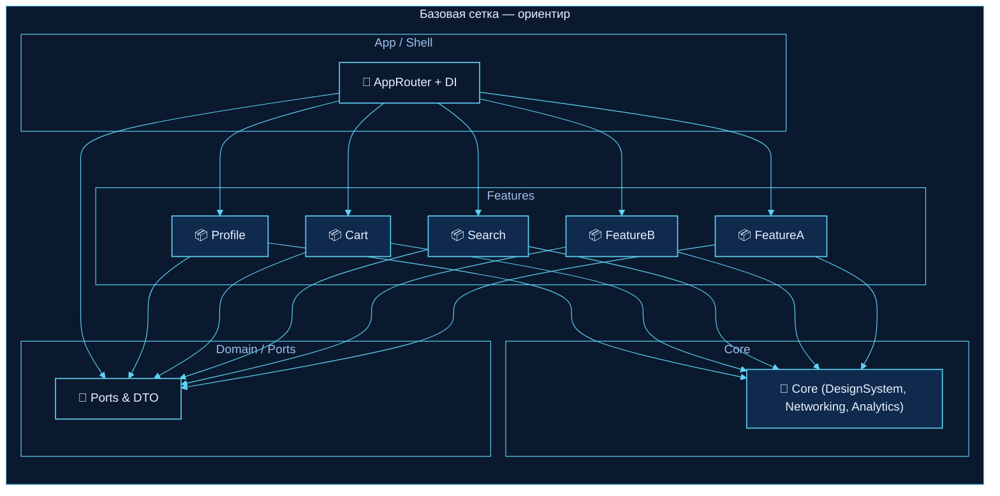

---

## 1) «FeatureA требует что-то из FeatureB»

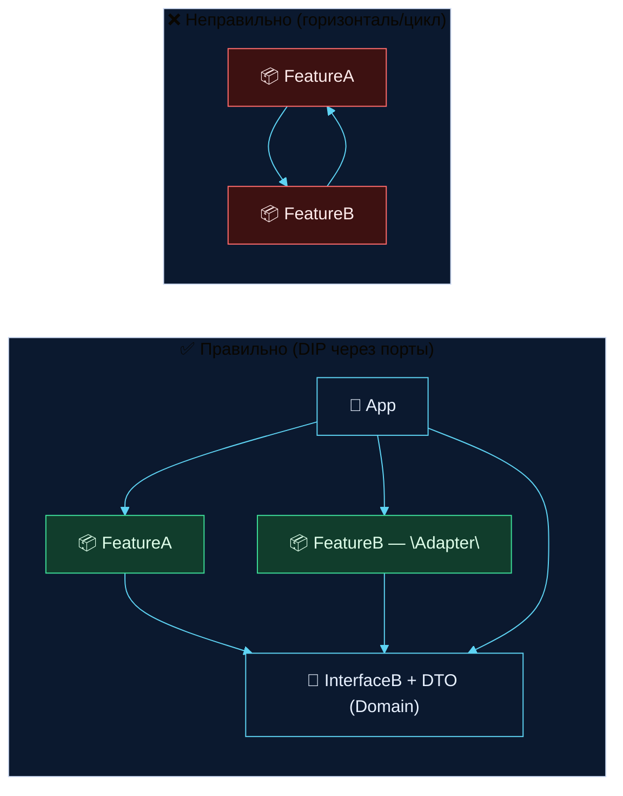

---

## 2) Навигация Cart → Profile

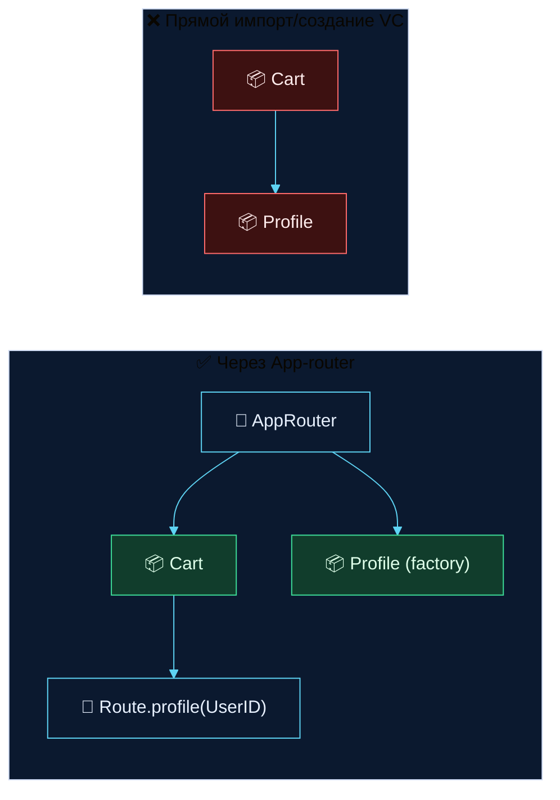

---

## 3) Search «хочет знать, что в корзине»

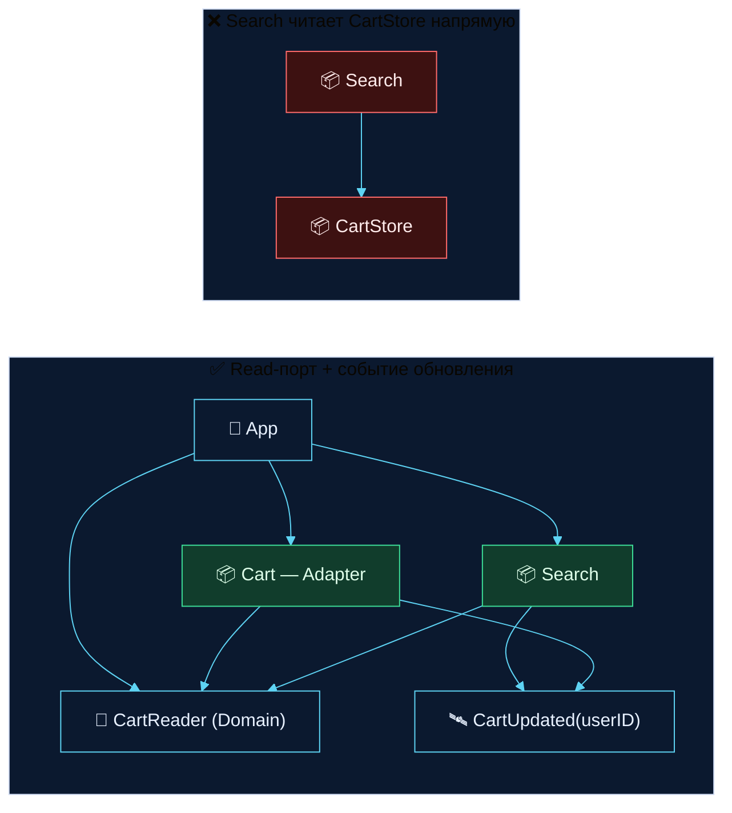

---

## 4) DesignSystem как «листовой» модуль (hub только вниз)

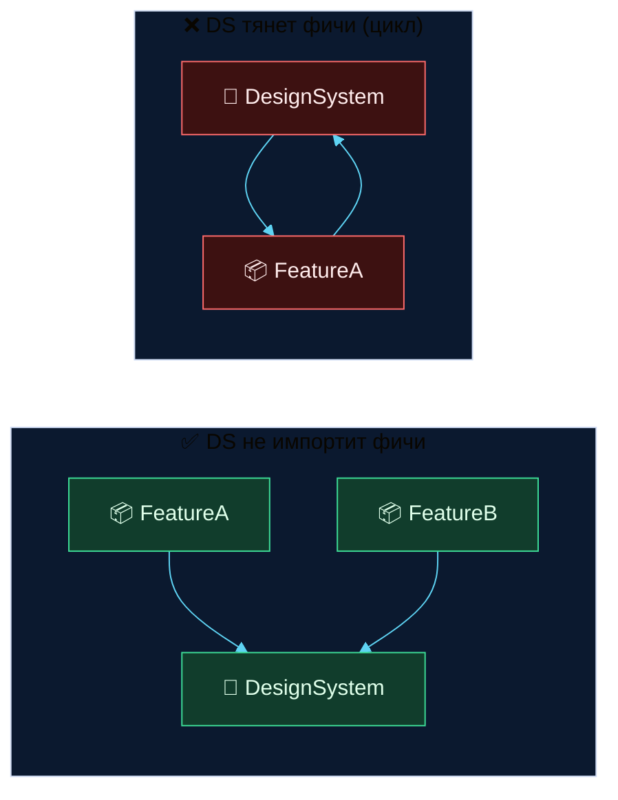

---

## 5) События — типобезопасная шина

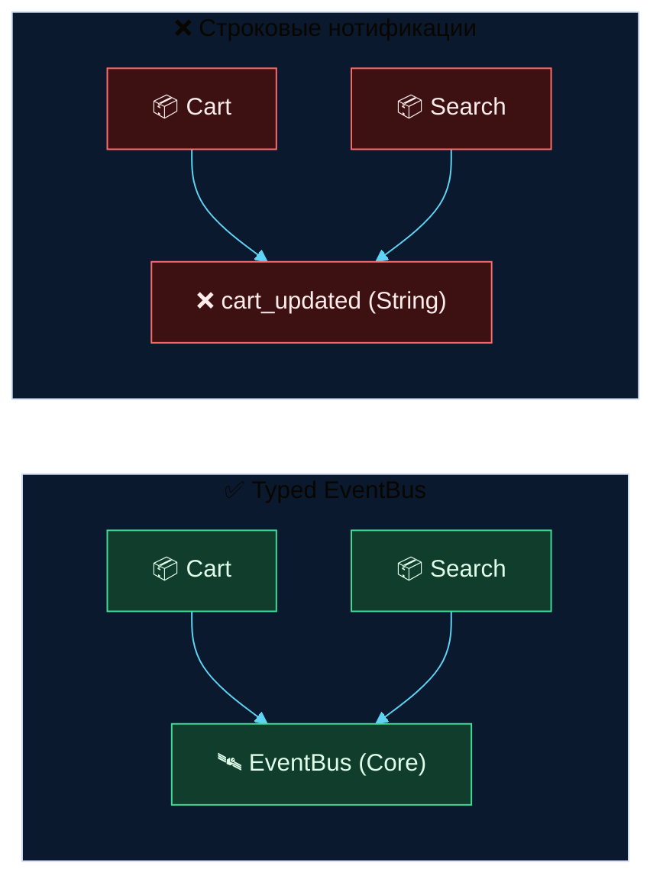

---

## 6) Глобальное состояние vs DI/Stores

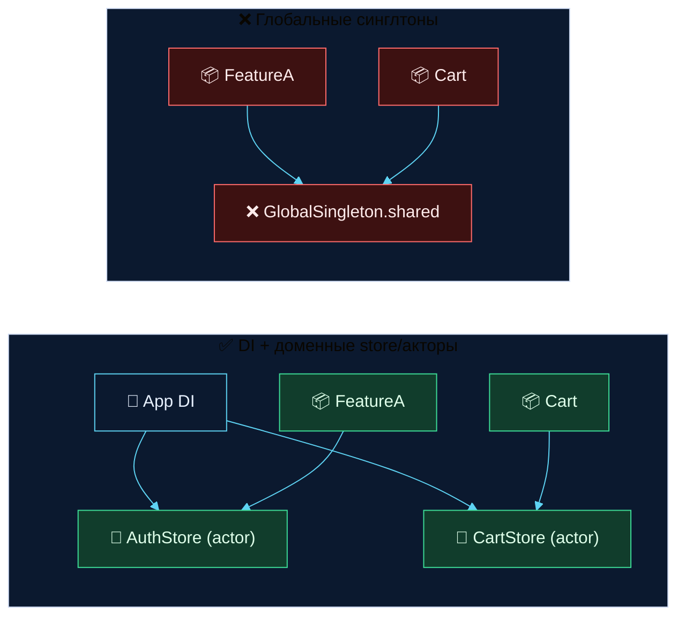

---

## 7) Тесты фичи без соседей

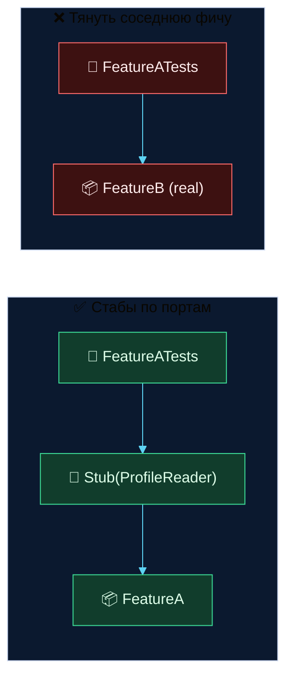

---

## 8) SharedModels — нейтральный слой

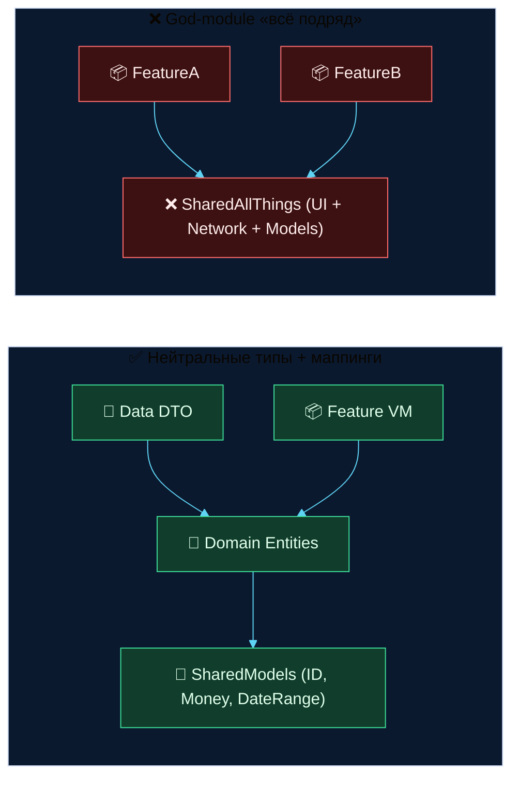

---

## 9) Сеть/База — через UseCase (не из UI)

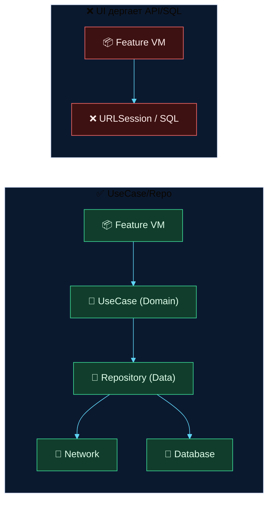

---

## 10) Widget/Extension — межпроцессные данные

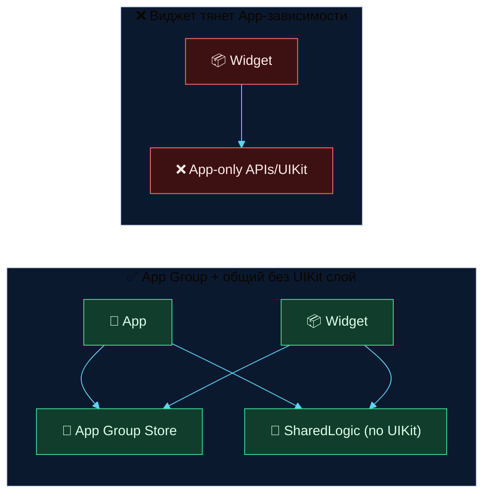

---

## 11) Кэш-цепочка (Chain of Responsibility) в data-слое

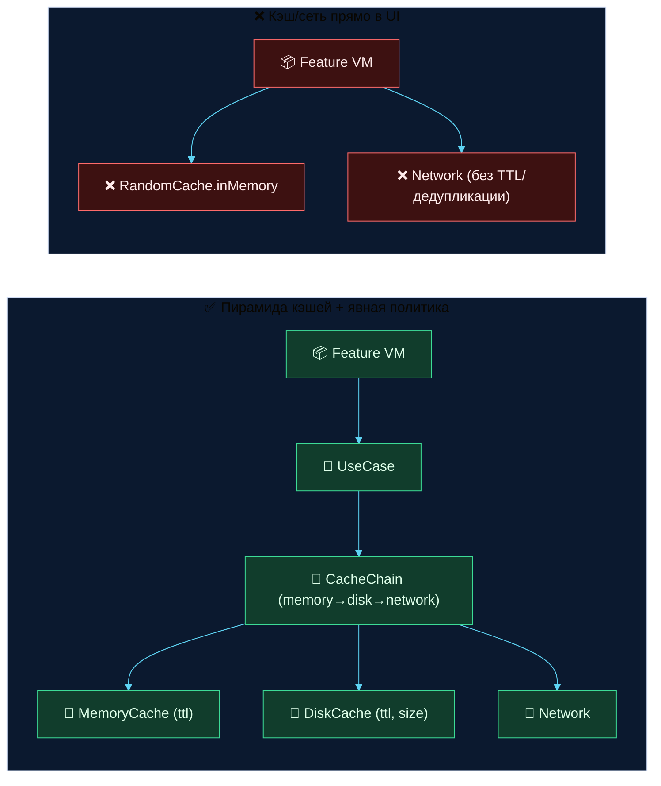

---

### (Опционально) Глобальный контраст для всех диаграмм через CSS-сниппет

Если хочешь, чтобы **все** Mermaid-диаграммы в Obsidian были контрастнее без `init`-блоков, создай сниппет `mermaid-contrast.css` и включи его в Настройки → Вид → CSS snippets:

```css
/* Mermaid контраст для тёмной темы Obsidian */
.theme-dark .markdown-preview-view .mermaid svg .edgePath path {
  stroke: #5ED3F3 !important;
  stroke-width: 2.5px !important;
}
.theme-dark .markdown-preview-view .mermaid svg .marker path {
  fill: #5ED3F3 !important;
}
.theme-dark .markdown-preview-view .mermaid svg .cluster rect {
  fill: #0b192f !important;
  stroke: #5ED3F3 !important;
}
.theme-dark .markdown-preview-view .mermaid svg .node rect,
.theme-dark .markdown-preview-view .mermaid svg .node circle,
.theme-dark .markdown-preview-view .mermaid svg .node ellipse,
.theme-dark .markdown-preview-view .mermaid svg .node polygon {
  stroke-width: 1.4px !important;
}
/* Отступы вокруг диаграмм, чтобы текст не наплывал */
.markdown-preview-view .mermaid {
  margin: 16px 0 !important;
}
```

Готово. Если нужно — добавлю сюда ещё пары под твои конкретные модули (Orders, Payments и т.д.).