## Модульная архитектура iOS: контракты, зависимости и кейсы

В этом гайде — единые названия модулей, обновлённая «правильная» диаграмма зависимостей (стрелка A → B читается как «A импортит B» — compile-time зависимость), кейсы «неправильно/правильно», чек-лист для самопроверки и минимальный SwiftPM скелет.

### Легенда

- **A → B**: модуль A импортит модуль B (compile-time зависимость).
- **Контракты**: интерфейсы/протоколы/типы, видимые «сверху». Реализации их не знают.
- **Impl**: конкретная реализация контракта. Импорты направлены вниз (к контрактам/фундаменту), горизонталей между фичами нет.
 - **Эмодзи**: ✅ — правильно, ❌ — неправильно.

### Правильная диаграмма (общая архитектура, финальная) ✅

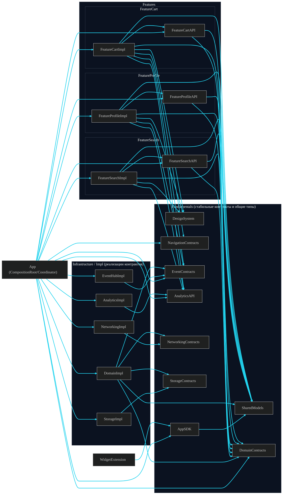

### Что означает диаграмма

- **FeatureXImpl** видит только свой `FeatureXAPI` и фундамент: `DesignSystem`, `SharedModels`, `DomainContracts`, `NavigationContracts`, `EventContracts`, `AnalyticsAPI` (по потребности). Горизонталей `Feature*Impl → Feature*Impl` нет.
- **FeatureXAPI** определяет публичные фабрики/протоколы/инпуты и опирается на общие типы (`SharedModels`) и, при необходимости, на доменные интерфейсы (`DomainContracts`).
- **DomainImpl / NetworkingImpl / StorageImpl / EventHubImpl / AnalyticsImpl** реализуют свои контракты: каждая `*Impl → *Contracts/API`.
- **DomainImpl** инкапсулирует стратегию данных (кеш-цепочки, правила, агрегации), работает с `NetworkingContracts`/`StorageContracts`, может эмитить события через `EventContracts`.
- **App** — Composition Root: единственный, кто «знает всех», импортит контракты и реализации, склеивает зависимости, строит флоу и навигацию.
- **DesignSystem/SharedModels** — «центр-хаб»: фичи зависят от них, они от фич — нет.
- **WidgetExtension** видит только `AppSDK` (узкий read-only SDK, базирующийся на `SharedModels`).

---

## Кейсы «неправильно / правильно» (с теми же именами)

### 1) Навигация: Cart открывает Profile

Неправильно ❌ (горизонталь):


Правильно ✅ (контракты навигации + склейка в App):

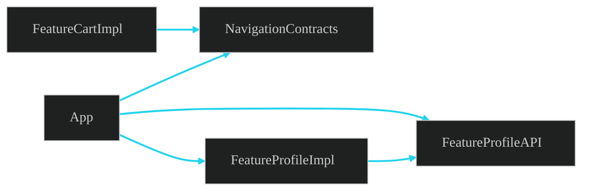

Смысл: `FeatureCartImpl` вызывает `Routing` из `NavigationContracts`; `App` реализует этот `Routing` и строит экран из `FeatureProfileImpl` (через `FeatureProfileAPI`).

---

### 2) Данные: Search хочет узнать, что в корзине

Неправильно ❌ (фича тянет реализацию соседней фичи):


Правильно ✅ (порт/контракт домена):

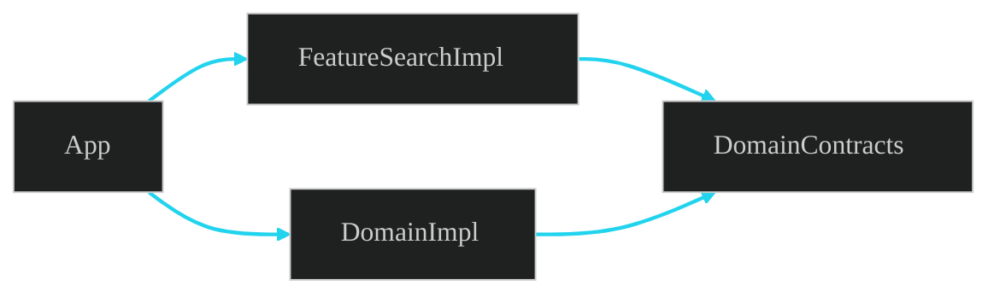

Смысл: объявляем `CartReading` в `DomainContracts`; `FeatureSearchImpl` зависит от `DomainContracts`, а `DomainImpl` эту зависимость реализует (склеивает `App`).

---

### 3) DesignSystem как центр, а не зависимый от фич

Неправильно ❌:


Правильно ✅:

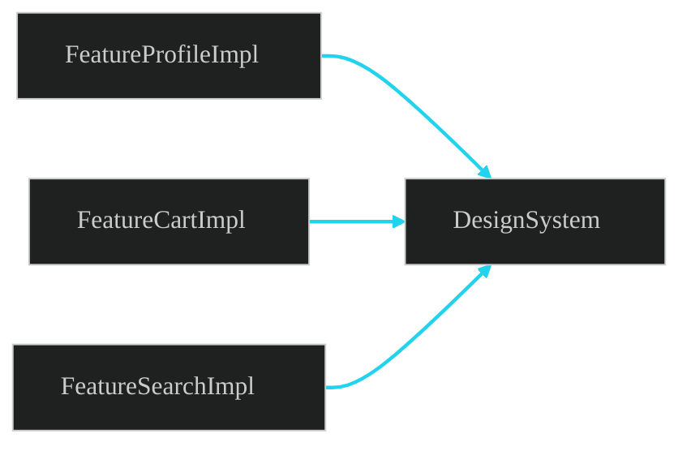

Смысл: `DesignSystem` — ядро UI-атомов; фичи его импортят, но не наоборот.

---

### 4) События: строковый глобальный шёпот vs типобезопасный EventHub

Неправильно ❌:

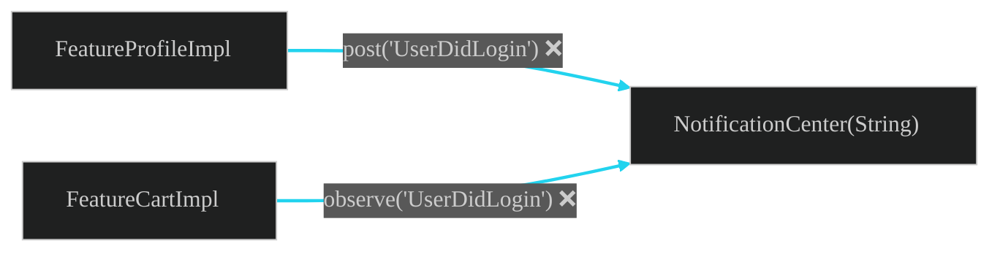

Правильно ✅:

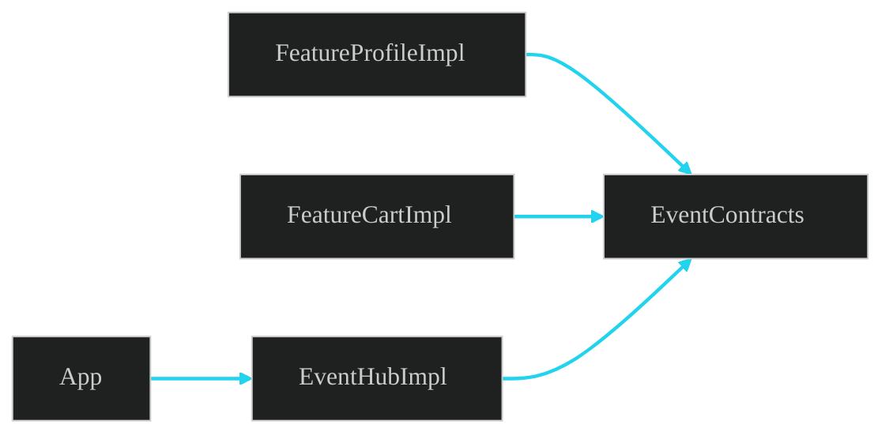

Смысл: события и хаб объявлены в `EventContracts`, реализация — `EventHubImpl`, поставляет её `App`.

---

### 5) Analytics: фичи пишут по API, а не в SDK

Неправильно ❌:


Правильно ✅:

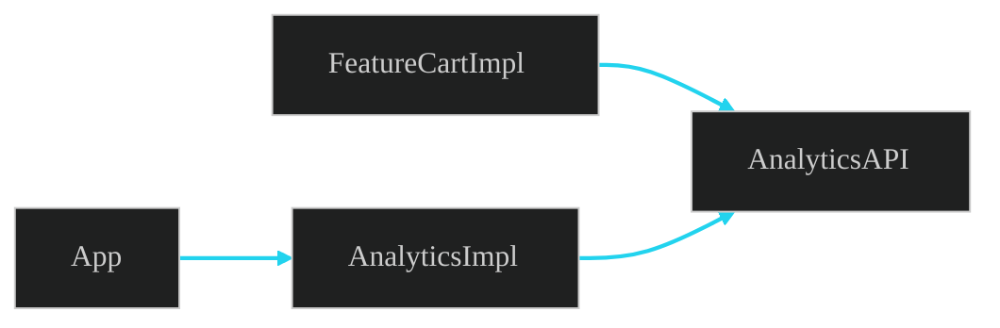

Смысл: фича зависит от `AnalyticsAPI`; `AnalyticsImpl` инкапсулирует конкретный SDK и подсовывается через `App`.

---

### 6) SharedModels: общие модели — не из чужой фичи

Неправильно ❌:


Правильно ✅:

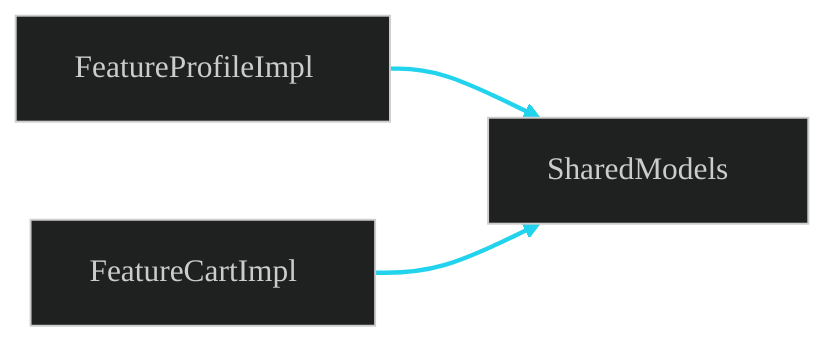

Смысл: общий тип (`UserID`, `Money`, и т.п.) живёт в `SharedModels`, а не внутри чьей-то фичи.

---

### 7) UI → сеть/БД напрямую (обход домена)

Неправильно ❌:

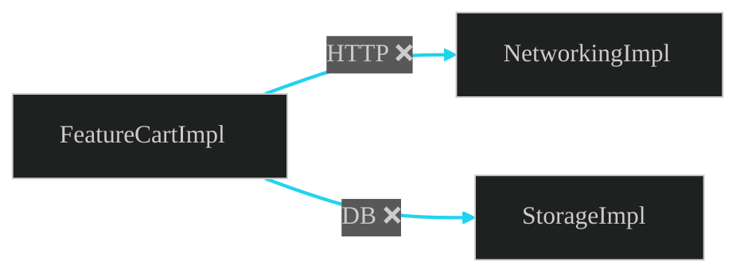

Правильно ✅:

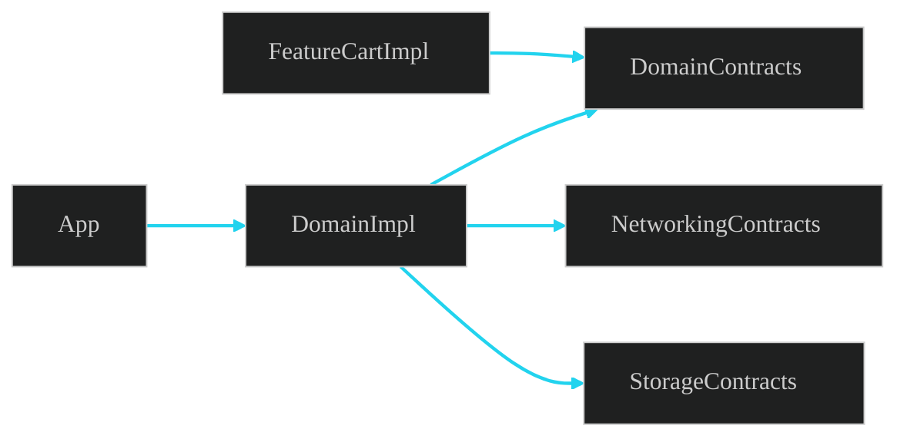

Смысл: UI работает с `UseCase`/репозиториями из `DomainContracts`; детали HTTP/DB скрыты в `DomainImpl` и далее в `NetworkingImpl`/`StorageImpl`.

---

### 8) WidgetExtension и общий код

Неправильно:


Правильно:

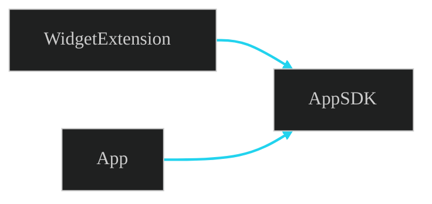

Смысл: выделяем `AppSDK` (read-only API/утилиты) для экстеншенов; они не зависят от целого `App`.

---

### 9) Кеш-цепочка (Chain of Responsibility) в data-слое, а не в UI

Неправильно:

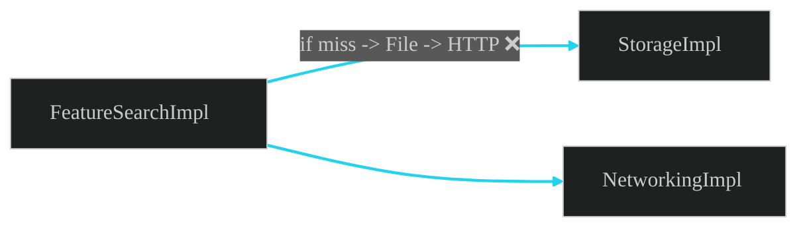

Правильно:

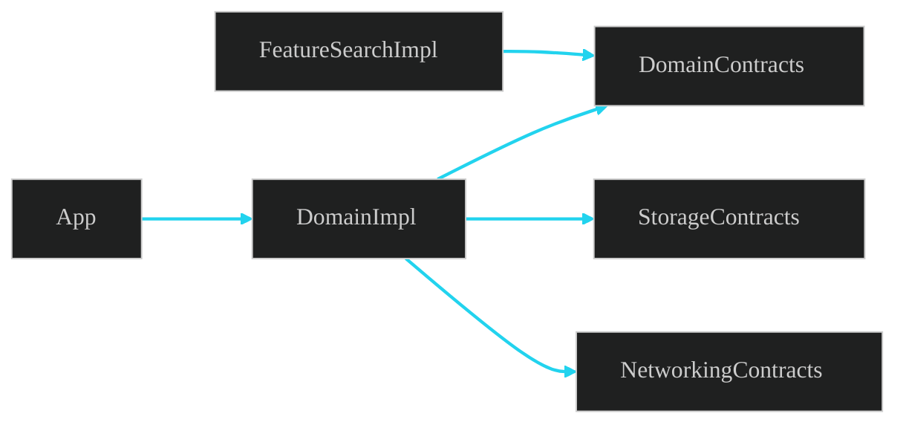

Смысл: стратегия кеширования инкапсулирована в `DomainImpl`; UI не знает порядок хранилищ.

---

## Чек-лист для подготовки к собесу

- **Границы модулей**: можешь объяснить, где проходят границы и почему они там?
- **Компоновка зависимостей**: как enforce-иться compile-time зависимости через SwiftPM/Xcode (only contracts в верхних слоях)?
- **Навигация**: как реализован `NavigationContracts` и кто его реализует? Как добавлять новые маршруты без каскада импортов?
- **Домен**: какие `UseCase`/репозитории живут в `DomainContracts`; как менять `DomainImpl`, не затрагивая UI?
- **События**: какие типы событий в `EventContracts`; кто и как их эмитит/слушает; как тестируешь EventHub?
- **Аналитика**: контракт `AnalyticsAPI`, как инкапсулируется вендорский SDK, как мокируется?
- **SharedModels**: критерии «общий тип», эволюция без ломающих изменений, версионирование?
- **DesignSystem**: структура токенов/атомов/молекул, отсутствие зависимости от фич, стратегия переиспользования.
- **Data слой**: как устроены `NetworkingContracts`/`StorageContracts`, ретраи, кеш-цепочки, политика TTL.
- **Тестирование**: как мокируются контракты; snapshot-тесты UI; контракты как seam для интеграционных тестов.
- **Расширяемость фич**: добавление новой фичи `FeatureX` — какие импорты допустимы, какие запрещены?
- **Отсутствие горизонталей**: как обнаруживать и предотвращать `FeatureAImpl → FeatureBImpl`?
- **AppSDK**: какие API нужны виджетам; почему он зависит только от `SharedModels`?
- **Сборка App**: где происходит склейка; фабрики экранов; DI подход (инициализация/композиция без сервиса-локатора).
- **Безопасная миграция**: как переносить типы между модулями без «ромашки» импортов.
 - **Стабильность контрактов**: критерии изменений контрактов, binary/source stability, семантическое версионирование.
 - **Observability**: где логирование/метрики/trace, как не протекать в фичи.
 - **Безопасность**: какие секреты/ключи где живут; зависимость UI от секретов запрещена.
 - **Performance**: cold start/модульная загрузка, размер бинарника, LTO и влияние на модульность.

---

## Минимальный SwiftPM скелет (targets и зависимости)

Ниже — один `Package.swift`, который создаёт модули-таргеты и проводит compile-time зависимости в точности по диаграмме. Обычно `App` — это Xcode App target, который импортит эти SPM-модули; сам `App` в `Package.swift` не описан.

```swift
// swift-tools-version: 5.9
import PackageDescription

let package = Package(
    name: "ModularApp",
    platforms: [
        .iOS(.v15)
    ],
    products: [
        // Fundamentals
        .library(name: "DesignSystem", targets: ["DesignSystem"]),
        .library(name: "SharedModels", targets: ["SharedModels"]),
        .library(name: "DomainContracts", targets: ["DomainContracts"]),
        .library(name: "NavigationContracts", targets: ["NavigationContracts"]),
        .library(name: "EventContracts", targets: ["EventContracts"]),
        .library(name: "AnalyticsAPI", targets: ["AnalyticsAPI"]),
        .library(name: "NetworkingContracts", targets: ["NetworkingContracts"]),
        .library(name: "StorageContracts", targets: ["StorageContracts"]),
        .library(name: "AppSDK", targets: ["AppSDK"]),

        // Impl
        .library(name: "DomainImpl", targets: ["DomainImpl"]),
        .library(name: "NetworkingImpl", targets: ["NetworkingImpl"]),
        .library(name: "StorageImpl", targets: ["StorageImpl"]),
        .library(name: "EventHubImpl", targets: ["EventHubImpl"]),
        .library(name: "AnalyticsImpl", targets: ["AnalyticsImpl"]),

        // Features
        .library(name: "FeatureCartAPI", targets: ["FeatureCartAPI"]),
        .library(name: "FeatureCartImpl", targets: ["FeatureCartImpl"]),
        .library(name: "FeatureProfileAPI", targets: ["FeatureProfileAPI"]),
        .library(name: "FeatureProfileImpl", targets: ["FeatureProfileImpl"]),
        .library(name: "FeatureSearchAPI", targets: ["FeatureSearchAPI"]),
        .library(name: "FeatureSearchImpl", targets: ["FeatureSearchImpl"])        
    ],
    targets: [
        // Fundamentals
        .target(name: "DesignSystem"),
        .target(name: "SharedModels"),
        .target(name: "DomainContracts", dependencies: [
            "SharedModels"
        ]),
        .target(name: "NavigationContracts"),
        .target(name: "EventContracts", dependencies: [
            "SharedModels"
        ]),
        .target(name: "AnalyticsAPI"),
        .target(name: "NetworkingContracts"),
        .target(name: "StorageContracts"),
        .target(name: "AppSDK", dependencies: [
            "SharedModels"
        ]),

        // Impl
        .target(name: "DomainImpl", dependencies: [
            "DomainContracts",
            "NetworkingContracts",
            "StorageContracts",
            "SharedModels",
            "EventContracts"
        ]),
        .target(name: "NetworkingImpl", dependencies: [
            "NetworkingContracts"
        ]),
        .target(name: "StorageImpl", dependencies: [
            "StorageContracts"
        ]),
        .target(name: "EventHubImpl", dependencies: [
            "EventContracts"
        ]),
        .target(name: "AnalyticsImpl", dependencies: [
            "AnalyticsAPI"
        ]),

        // Features
        .target(name: "FeatureCartAPI", dependencies: [
            "SharedModels",
            "DomainContracts"
        ]),
        .target(name: "FeatureCartImpl", dependencies: [
            "FeatureCartAPI",
            "DesignSystem",
            "SharedModels",
            "DomainContracts",
            "NavigationContracts",
            "EventContracts",
            "AnalyticsAPI"
        ]),

        .target(name: "FeatureProfileAPI", dependencies: [
            "SharedModels",
            "DomainContracts"
        ]),
        .target(name: "FeatureProfileImpl", dependencies: [
            "FeatureProfileAPI",
            "DesignSystem",
            "SharedModels",
            "DomainContracts",
            "EventContracts",
            "AnalyticsAPI"
        ]),

        .target(name: "FeatureSearchAPI", dependencies: [
            "SharedModels",
            "DomainContracts"
        ]),
        .target(name: "FeatureSearchImpl", dependencies: [
            "FeatureSearchAPI",
            "DesignSystem",
            "SharedModels",
            "DomainContracts",
            "AnalyticsAPI"
        ])
    ]
)
```

Подключи эти модули в Xcode-проект и собери App target, который импортит только нужные библиотеки. Так на уровне компоновки зависимостей Xcode/SwiftPM ты увидишь граф «вживую».

### Быстрый старт (локально)

```bash
mkdir ModularApp && cd ModularApp
swift package init --type library
rm -rf Sources Tests
cat > Package.swift <<'SWIFT'
// swift-tools-version: 5.9
import PackageDescription

let package = Package(
    name: "ModularApp",
    platforms: [ .iOS(.v15) ],
    products: [
        .library(name: "DesignSystem", targets: ["DesignSystem"]),
        .library(name: "SharedModels", targets: ["SharedModels"]),
        .library(name: "DomainContracts", targets: ["DomainContracts"]),
        .library(name: "NavigationContracts", targets: ["NavigationContracts"]),
        .library(name: "EventContracts", targets: ["EventContracts"]),
        .library(name: "AnalyticsAPI", targets: ["AnalyticsAPI"]),
        .library(name: "NetworkingContracts", targets: ["NetworkingContracts"]),
        .library(name: "StorageContracts", targets: ["StorageContracts"]),
        .library(name: "AppSDK", targets: ["AppSDK"]),
        .library(name: "DomainImpl", targets: ["DomainImpl"]),
        .library(name: "NetworkingImpl", targets: ["NetworkingImpl"]),
        .library(name: "StorageImpl", targets: ["StorageImpl"]),
        .library(name: "EventHubImpl", targets: ["EventHubImpl"]),
        .library(name: "AnalyticsImpl", targets: ["AnalyticsImpl"]),
        .library(name: "FeatureCartAPI", targets: ["FeatureCartAPI"]),
        .library(name: "FeatureCartImpl", targets: ["FeatureCartImpl"]),
        .library(name: "FeatureProfileAPI", targets: ["FeatureProfileAPI"]),
        .library(name: "FeatureProfileImpl", targets: ["FeatureProfileImpl"]),
        .library(name: "FeatureSearchAPI", targets: ["FeatureSearchAPI"]),
        .library(name: "FeatureSearchImpl", targets: ["FeatureSearchImpl"])        
    ],
    targets: [
        .target(name: "DesignSystem"),
        .target(name: "SharedModels"),
        .target(name: "DomainContracts", dependencies: ["SharedModels"]),
        .target(name: "NavigationContracts"),
        .target(name: "EventContracts", dependencies: ["SharedModels"]),
        .target(name: "AnalyticsAPI"),
        .target(name: "NetworkingContracts"),
        .target(name: "StorageContracts"),
        .target(name: "AppSDK", dependencies: ["SharedModels"]),
        .target(name: "DomainImpl", dependencies: [
            "DomainContracts", "NetworkingContracts", "StorageContracts", "SharedModels", "EventContracts"
        ]),
        .target(name: "NetworkingImpl", dependencies: ["NetworkingContracts"]),
        .target(name: "StorageImpl", dependencies: ["StorageContracts"]),
        .target(name: "EventHubImpl", dependencies: ["EventContracts"]),
        .target(name: "AnalyticsImpl", dependencies: ["AnalyticsAPI"]),
        .target(name: "FeatureCartAPI", dependencies: ["SharedModels", "DomainContracts"]),
        .target(name: "FeatureCartImpl", dependencies: [
            "FeatureCartAPI", "DesignSystem", "SharedModels", "DomainContracts", "NavigationContracts", "EventContracts", "AnalyticsAPI"
        ]),
        .target(name: "FeatureProfileAPI", dependencies: ["SharedModels", "DomainContracts"]),
        .target(name: "FeatureProfileImpl", dependencies: [
            "FeatureProfileAPI", "DesignSystem", "SharedModels", "DomainContracts", "EventContracts", "AnalyticsAPI"
        ]),
        .target(name: "FeatureSearchAPI", dependencies: ["SharedModels", "DomainContracts"]),
        .target(name: "FeatureSearchImpl", dependencies: [
            "FeatureSearchAPI", "DesignSystem", "SharedModels", "DomainContracts", "AnalyticsAPI"
        ])
    ]
)
SWIFT

swift package resolve
open Package.swift
```

---

## Короткий словарь

- **FeatureXAPI** — публичный контракт фичи (фабрики/инпут-модели/протоколы).
- **FeatureXImpl** — реализация фичи (VC/View/Presenter/координаторы фичи) — `internal`.
- **NavigationContracts** — `Routing`, `AppRoute` и пр. для навигации.
- **DomainContracts** — use case/репозитории/доменные модели.
- **DomainImpl** — композиция use case’ов и правил, реализация домена.
- **NetworkingContracts / StorageContracts** — интерфейсы транспорта и хранилищ.
- **NetworkingImpl / StorageImpl** — конкретные HTTP/DB реализации.
- **EventContracts / EventHubImpl** — типобезопасные события/шина.
- **AnalyticsAPI / AnalyticsImpl** — абстракция для аналитики и её реализация.
- **DesignSystem** — UI-атомы/токены/контролы, без зависимостей на фичи.
- **SharedModels** — нейтральные `struct/enum`, общие для нескольких фич.
- **App** — Composition Root/Coordinator: знает всех, собирает и связывает.
- **AppSDK** — узкий SDK для экстеншенов/виджетов.
- **WidgetExtension** — таргет виджета, видит только `AppSDK`.


